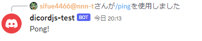

# Discord Botの作り方
pingコマンドだけを実装したサンプル。




https://discordjs.guide/creating-your-bot/

以上の記事の通り。日本語の記事もあるがちょっと情報が古いかもしれない。

https://www.geeklibrary.jp/counter-attack/discord-js-bot/


カレントディレクトリのconfig.jsonファイルを新たに作成して、

```
{
	"token": "xxxxxxx",
	"clientId": "xxxxxxx",
	"guildId": "xxxxxxx"
}
```

を記述して保存。xxxxのところは自分のトークンなどを入れる。tokenは https://discord.com/developers/applications でアプリを作成してregenerateすることで表示される。clientIdは作成したアプリケーションのページで見れる。ボットの情報を作る必要もある。

guildIdは、サーバーIDのこと。Discordを設定、詳細設定から開発者モードをオンにしてサーバーIDをコピー。

```
https://discord.com/api/oauth2/authorize?client_id={clientId}&permissions=0&scope=bot%20applications.commands
```

{clientId} を置き換えたURLにアクセスしてサーバーにボットインストール。

スクリプトを書いて、

```
node deploy-commands.js
```

でping.jsコマンドをデプロイ。

```
node index.js
```

でBotを起動。コードの解説は元記事を参考の事。
